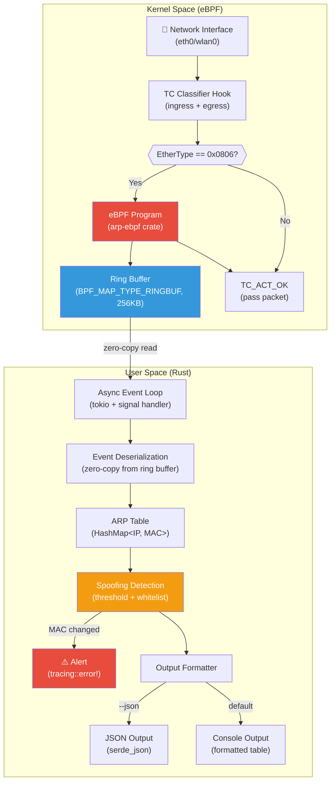
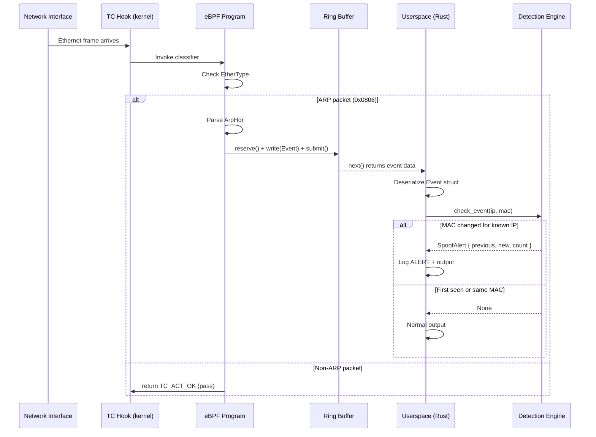

# ARP Monitor — eBPF/Rust

[](https://github.com/saultab/arp-monitor-ebpf-rust/actions/workflows/ci.yml)
[](LICENSE)
[](https://www.rust-lang.org/)
[](https://ebpf.io/)
[](https://kernel.org/)

A **kernel-level ARP traffic monitor** with real-time **ARP spoofing detection**, built with **eBPF** (TC classifier hook) and **Rust**. Captures every ARP packet traversing a network interface with **zero-copy** efficiency directly from kernel space — no libpcap, no packet duplication, no overhead.

---

## Table of Contents

- [Why This Project](#why-this-project)
- [How It Works (TL;DR)](#how-it-works-tldr)
- [Demo](#demo)
- [Tech Stack](#tech-stack)
- [Project Structure](#project-structure)
- [System Requirements](#system-requirements)
- [Installation & Build](#installation--build)
- [Usage](#usage)
- [Architecture](#architecture)
- [ARP Protocol Background](#arp-protocol-background)
- [Spoofing Detection Logic](#spoofing-detection-logic)
- [Security Considerations](#security-considerations)
- [Performance](#performance)
- [Technical Challenges & Learnings](#technical-challenges--learnings)
- [Testing](#testing)
- [Troubleshooting](#troubleshooting)
- [Limitations & Roadmap](#limitations--roadmap)
- [License](#license)
- [Contributing](#contributing)

---

## Why This Project

This project demonstrates production-grade systems programming at the intersection of:

| Skill | How it's applied |
|-------|-----------------|
| **Rust** | Safe, zero-cost abstractions for both userspace logic and eBPF bytecode generation |
| **eBPF / Kernel programming** | In-kernel packet filtering via TC classifier, ring buffer IPC, verifier compliance |
| **Network security** | ARP spoofing detection with configurable thresholds, whitelist-based trust model |
| **Performance engineering** | Zero-copy event delivery, async I/O, lock-free ring buffer, no busy-wait loops |
| **Observability** | Structured tracing with env-filter, JSON output for SIEM integration |
| **Systems design** | Shared memory layout (`#[repr(C)]`) between kernel/userspace, safe FFI boundaries |

> **For recruiters/hiring managers**: This project showcases the ability to write code that runs *inside the Linux kernel* safely, handle low-level networking protocols, and build observable, well-tested systems software — skills directly applicable to infrastructure, security, and performance-critical roles.

---

## How It Works (TL;DR)

```
┌─────────────────────────────────────────────────────────┐
│  Linux Kernel                                           │
│                                                         │
│  NIC ──► TC Hook ──► eBPF Program ──► Ring Buffer ─────┼──► Userspace (Rust)
│          (ingress       (filters ARP,    (256KB,        │     (async poll,
│           + egress)      extracts fields) zero-copy)    │      detection,
│                                                         │      alerting)
└─────────────────────────────────────────────────────────┘
```

1. Every packet hitting the network interface passes through the TC (Traffic Control) hook
2. Our eBPF program — compiled to BPF bytecode from Rust — inspects the EtherType field
3. If it's ARP (0x0806), the program extracts sender/target MAC and IP, writes to a ring buffer
4. Userspace reads events asynchronously, checks against an IP→MAC mapping, alerts on anomalies

---

### How to Capture These Demos

1. **Live monitoring** — Run the tool on an active network and watch ARP packets flow:
   ```bash
   sudo target/release/arp -i eth0 --verbose
   # In another terminal, trigger ARP:
   arping -c 3 192.168.1.1
   ```

2. **Spoofing simulation** — Use network namespaces for a safe, isolated lab:
   ```bash
   # Setup (see Testing section for full script)
   sudo ip netns add attacker
   sudo ip link add veth0 type veth peer name veth1
   sudo ip link set veth1 netns attacker
   # ... configure IPs, then:
   sudo ip netns exec attacker arpspoof -i veth1 -t 10.0.0.1 10.0.0.2
   ```

3. **JSON output** — Pipe through `jq` for pretty colors:
   ```bash
   sudo target/release/arp -i eth0 --json | jq .
   ```

4. **Architecture diagram** — Copy the Mermaid block below into [mermaid.live](https://mermaid.live) and export as PNG

---

## Tech Stack

| Component | Technology | Purpose |
|-----------|-----------|---------|
| eBPF framework | [Aya](https://aya-rs.dev/) 0.13 | Load, attach, manage eBPF programs from Rust |
| eBPF target | [aya-ebpf](https://docs.rs/aya-ebpf/) 0.1 | Write eBPF programs in Rust (no C) |
| Async runtime | [Tokio](https://tokio.rs/) 1.x | Non-blocking event loop, signal handling |
| CLI | [Clap](https://docs.rs/clap/) 4 (derive macro) | Type-safe argument parsing |
| Logging | [Tracing](https://docs.rs/tracing/) 0.1 | Structured, leveled, filterable logging |
| Serialization | [Serde](https://serde.rs/) + serde_json | JSON output mode |
| Time | [Chrono](https://docs.rs/chrono/) | Timestamp formatting |
| Network types | [network-types](https://docs.rs/network-types/) 0.0.7 | Ethernet/ARP header definitions |
| Build system | Cargo xtask pattern | Reproducible eBPF + userspace builds |
| Hook type | TC classifier | Ingress + egress packet inspection |
| IPC mechanism | BPF Ring Buffer | Zero-copy, ordered, kernel→userspace events |

---

## Project Structure

```
arp-monitor-ebpf-rust/
├── Cargo.toml              # Workspace root with shared dependencies
├── arp/                    # Userspace application
│   ├── Cargo.toml
│   └── src/
│       ├── main.rs         # Entry point: CLI, eBPF loading, event loop
│       └── detection.rs    # ARP spoofing detection engine
├── arp-ebpf/               # Kernel-space eBPF program
│   ├── Cargo.toml
│   ├── rust-toolchain.toml # Pinned nightly for BPF compilation
│   └── src/
│       └── main.rs         # TC classifier: filter ARP, emit events
├── arp-common/             # Shared types (kernel ↔ userspace)
│   ├── Cargo.toml
│   └── src/
│       └── lib.rs          # Event, ArpHdr structs (#[repr(C)])
├── xtask/                  # Build automation
│   ├── Cargo.toml
│   └── src/
│       ├── main.rs
│       ├── build_ebpf.rs   # Cross-compile eBPF to bpfel-unknown-none
│       └── run.rs          # Build + run with sudo
├── .github/workflows/
│   └── ci.yml              # GitHub Actions: fmt, clippy, test, build
├── Dockerfile              # Multi-stage build for containerized deployment
├── CHANGELOG.md            # All changes documented with rationale
└── docs/screenshots/       # Demo assets placeholder
```

### Crate Responsibilities

| Crate | Target | Role |
|-------|--------|------|
| `arp` | `x86_64-unknown-linux-gnu` | Userspace binary — loads eBPF, processes events, detection logic |
| `arp-ebpf` | `bpfel-unknown-none` | eBPF bytecode — runs in kernel, filters packets |
| `arp-common` | Both | Shared data structures with `#[repr(C)]` layout guarantee |
| `xtask` | Host | Build orchestration (like a Makefile, but in Rust) |

---

## System Requirements

| Requirement | Minimum | Notes |
|-------------|---------|-------|
| Linux kernel | **5.8+** | Ring buffer map support (`BPF_MAP_TYPE_RINGBUF`) |
| Capabilities | `CAP_BPF` + `CAP_NET_ADMIN` | Or run as root. Required for loading eBPF and attaching to TC |
| Rust (userspace) | stable 1.70+ | Standard toolchain |
| Rust (eBPF) | nightly | Required for `-Z build-std=core` and BPF target |
| bpf-linker | latest | Links eBPF object files |
| Architecture | x86_64, aarch64 | eBPF bytecode is portable (little-endian by default) |

### Tested Distributions

| Distribution | Kernel | Status |
|-------------|--------|--------|
| Ubuntu 22.04 LTS | 5.15+ | ✅ Works |
| Ubuntu 24.04 LTS | 6.8+ | ✅ Works |
| Fedora 38+ | 6.2+ | ✅ Works |
| Arch Linux | Rolling | ✅ Works |
| Debian 12 | 6.1+ | ✅ Works |
| RHEL/Rocky 9 | 5.14 | ⚠️ Needs kernel upgrade for ring buffer |

### Checking Your Kernel Version

```bash
uname -r
# Must be >= 5.8.0

# Verify BPF support
cat /boot/config-$(uname -r) | grep CONFIG_BPF
# CONFIG_BPF=y
# CONFIG_BPF_SYSCALL=y
# CONFIG_BPF_JIT=y
```

---

## Installation & Build

### Prerequisites

```bash
# 1. Install Rust (if not already installed)
curl --proto '=https' --tlsv1.2 -sSf https://sh.rustup.rs | sh
source ~/.cargo/env

# 2. Install nightly toolchain with rust-src (for eBPF cross-compilation)
rustup toolchain install nightly --component rust-src

# 3. Install bpf-linker (links BPF object files)
cargo install bpf-linker

# 4. (Optional) Install development headers for your kernel
# Ubuntu/Debian:
sudo apt install linux-headers-$(uname -r) build-essential
# Fedora:
sudo dnf install kernel-devel
```

### Build Steps

```bash
# Clone the repository
git clone https://github.com/saultab/arp-monitor-ebpf-rust.git
cd arp-monitor-ebpf-rust

# Step 1: Build the eBPF program (cross-compiled to BPF bytecode)
cargo xtask build-ebpf

# Step 2: Build the userspace binary
cargo build --release

# The final binary is at: target/release/arp
```

### One-Liner (release build)

```bash
cargo xtask build-ebpf --release && cargo build --release
```

### Docker Deployment

```bash
# Build the container image
docker build -t arp-monitor .

# Run with custom interface
docker run --privileged --network=host arp-monitor -i wlan0
```

### Running Without Root (capabilities)

```bash
# Set capabilities on the binary instead of running as root
sudo setcap cap_bpf,cap_net_admin=eip target/release/arp

# Now you can run without sudo
./target/release/arp -i eth0
```

---

## Usage

### CLI Reference

```
eBPF-powered ARP traffic monitor with spoofing detection

Usage: arp [OPTIONS]

Options:
  -i, --iface <IFACE>            Network interface to attach to [default: eth0]
  -v, --verbose                  Enable verbose (debug-level) output
      --json                     Output events as JSON (one object per line)
      --whitelist <IP=MAC>       Trusted IP-MAC pairs (repeatable)
      --spoof-threshold <N>      MAC changes before alerting [default: 1]
  -h, --help                     Print help
```

### Examples

```bash
# Monitor the default interface (eth0)
sudo target/release/arp

# Monitor a specific interface with debug logging
sudo target/release/arp -i ens33 --verbose

# JSON output for SIEM/Splunk/ELK ingestion
sudo target/release/arp -i eth0 --json >> /var/log/arp-events.jsonl

# Define trusted gateway + DNS server MACs (won't trigger false alerts)
sudo target/release/arp -i eth0 \
  --whitelist 192.168.1.1=aa:bb:cc:dd:ee:ff \
  --whitelist 192.168.1.53=11:22:33:44:55:66

# Higher sensitivity threshold (reduce noise on DHCP-heavy networks)
sudo target/release/arp -i eth0 --spoof-threshold 3

# Combine: JSON + whitelist + verbose
sudo target/release/arp -i eth0 --json --verbose \
  --whitelist 10.0.0.1=00:1a:2b:3c:4d:5e

# Using cargo xtask (builds everything + runs with sudo)
RUST_LOG=debug cargo xtask run -- -i eth0 --verbose
```

### Example Console Output

```
TIME         TYPE       SENDER MAC           SENDER IP          TARGET MAC           TARGET IP
14:32:01     Request    aa:bb:cc:dd:ee:01    192.168.1.10       ff:ff:ff:ff:ff:ff    192.168.1.1
14:32:01     Reply      11:22:33:44:55:66    192.168.1.1        aa:bb:cc:dd:ee:01    192.168.1.10
14:32:03     Request    aa:bb:cc:dd:ee:01    192.168.1.10       ff:ff:ff:ff:ff:ff    192.168.1.254
14:32:05     Reply      de:ad:be:ef:00:01    192.168.1.1        aa:bb:cc:dd:ee:01    192.168.1.10  ⚠ SPOOF
```

### Example JSON Output

```json
{"timestamp":"14:32:01","opcode":"Request","sender_mac":"aa:bb:cc:dd:ee:01","sender_ip":"192.168.1.10","target_mac":"ff:ff:ff:ff:ff:ff","target_ip":"192.168.1.1","alert":null}
{"timestamp":"14:32:05","opcode":"Reply","sender_mac":"de:ad:be:ef:00:01","sender_ip":"192.168.1.1","target_mac":"aa:bb:cc:dd:ee:01","target_ip":"192.168.1.10","alert":{"ip":"192.168.1.1","previous_mac":"11:22:33:44:55:66","new_mac":"de:ad:be:ef:00:01","change_count":1}}
```

Pretty-printed with `jq`:

```json
{
  "timestamp": "14:32:05",
  "opcode": "Reply",
  "sender_mac": "de:ad:be:ef:00:01",
  "sender_ip": "192.168.1.1",
  "target_mac": "aa:bb:cc:dd:ee:01",
  "target_ip": "192.168.1.10",
  "alert": {
    "ip": "192.168.1.1",
    "previous_mac": "11:22:33:44:55:66",
    "new_mac": "de:ad:be:ef:00:01",
    "change_count": 1
  }
}
```

---

## Architecture

### High-Level Diagram



### Sequence Diagram (Normal Flow)



### Data Flow Detail

1. **NIC** receives an Ethernet frame on the monitored interface
2. **TC qdisc (clsact)** routes the packet through the classifier chain
3. **eBPF classifier** (attached to both ingress and egress with priority 65535):
   - Reads EtherType from Ethernet header (bounds-checked via `ptr_at<T>`)
   - If not ARP → returns `TC_ACT_OK` immediately (zero overhead for non-ARP)
   - If ARP → loads the full ARP header, extracts fields into `Event` struct
   - Reserves space in ring buffer, writes event, submits
4. **Ring buffer** stores events in a shared memory region (256KB, configurable)
5. **Userspace async poller** (tokio) reads events every 10ms cycle
6. **Deserialization**: zero-copy pointer cast from ring buffer memory to `Event`
7. **Detection engine** (`HashMap<Ipv4Addr, MacEntry>`):
   - First time seeing an IP → store MAC, no alert
   - Same MAC → no alert
   - Different MAC → increment change counter, alert if ≥ threshold
   - Whitelisted IP with wrong MAC → always alert immediately
8. **Output** renders as aligned table (human) or NDJSON (machine)

---

## ARP Protocol Background

ARP (Address Resolution Protocol, [RFC 826](https://tools.ietf.org/html/rfc826)) maps Layer 3 (IP) addresses to Layer 2 (MAC) addresses on local networks.

### ARP Packet Structure (as captured by this tool)

```
┌─────────────────────────────────────────────────────┐
│ Ethernet Header (14 bytes)                          │
├─────────────────────────────────────────────────────┤
│ Hardware Type (2B) │ Protocol Type (2B)             │
│ HW Addr Len (1B)  │ Proto Addr Len (1B)            │
│ Opcode (2B): 1=Request, 2=Reply                    │
├─────────────────────────────────────────────────────┤
│ Sender Hardware Address (6B) ← sender MAC          │
│ Sender Protocol Address (4B) ← sender IP           │
│ Target Hardware Address (6B) ← target MAC          │
│ Target Protocol Address (4B) ← target IP           │
└─────────────────────────────────────────────────────┘
```

### Why ARP is Vulnerable

ARP is **stateless** and **unauthenticated**:
- Any host can send unsolicited ARP replies (gratuitous ARP)
- Receivers blindly update their ARP cache
- An attacker can associate their MAC with a victim's IP → **Man-in-the-Middle**

This tool detects such attacks by tracking which MAC is associated with each IP over time.

---

## Spoofing Detection Logic

### Algorithm

```
for each ARP event (sender_ip, sender_mac):
    if sender_ip in whitelist:
        if sender_mac == whitelist[sender_ip]:  → PASS (trusted)
        else:                                    → ALERT (trusted IP, wrong MAC!)
    
    if sender_ip not seen before:
        table[sender_ip] = { mac: sender_mac, changes: 0 }
        → PASS (learning)
    
    if table[sender_ip].mac == sender_mac:
        → PASS (consistent)
    
    if table[sender_ip].mac != sender_mac:
        table[sender_ip].changes += 1
        table[sender_ip].mac = sender_mac
        if changes >= threshold:
            → ALERT (possible spoofing!)
```

### Configuration

| Parameter | Default | Description |
|-----------|---------|-------------|
| `--spoof-threshold` | 1 | Alert after N MAC changes for the same IP |
| `--whitelist` | (none) | Known-good IP=MAC pairs; wrong MAC → immediate alert |

### Example Scenarios

| Scenario | Behavior |
|----------|----------|
| Gateway sends ARP reply | First seen → learned. Same MAC later → silent |
| Attacker sends fake ARP reply for gateway IP | Different MAC detected → **⚠ ALERT** |
| DHCP lease renewal changes MAC | May trigger alert (increase threshold for DHCP networks) |
| Whitelisted gateway with forged MAC | Immediate alert regardless of threshold |

---

## Security Considerations

### Privileges Required

| Capability | Why |
|-----------|-----|
| `CAP_BPF` | Load eBPF programs into the kernel |
| `CAP_NET_ADMIN` | Attach TC classifier to network interfaces |

**Recommendation**: Use Linux capabilities instead of full root:
```bash
sudo setcap cap_bpf,cap_net_admin=eip target/release/arp
```

### What This Tool Does NOT Do

- ❌ Does not modify or drop packets (passive monitoring only)
- ❌ Does not inject corrective ARP replies (no active defense)
- ❌ Does not persist data to disk by default (no data-at-rest concerns)
- ❌ Does not open network ports or accept remote connections

### Supply Chain

- All dependencies are from crates.io (no git dependencies)
- `Cargo.lock` is committed for reproducible builds
- CI runs `cargo clippy` with `-D warnings` to catch unsafe patterns

---

## Performance

### Design Choices for Efficiency

| Aspect | Approach |
|--------|----------|
| Packet filtering | Done in kernel (eBPF) — non-ARP packets never reach userspace |
| Data transfer | Ring buffer (zero-copy, single shared mapping) |
| Event deserialization | Pointer cast, not memcpy |
| Polling | Async 10ms sleep between cycles (not busy-loop) |
| Memory | Fixed 256KB ring buffer, no dynamic allocation in kernel |
| Non-ARP overhead | Single branch (`if EtherType != ARP → return`) ≈ 3 instructions |

### Overhead Characteristics

- **Non-ARP traffic**: Near-zero overhead (single integer comparison in kernel)
- **ARP traffic**: ~200ns per packet (kernel parse + ring buffer write)
- **Userspace**: <1% CPU at typical ARP rates (<100 packets/sec on LAN)
- **Memory**: ~1MB resident (userspace) + 256KB (kernel ring buffer)

### Comparison with Alternatives

| Tool | Mechanism | ARP detection | Overhead |
|------|-----------|---------------|----------|
| **This tool** | eBPF TC + Ring Buffer | ✅ Yes | Minimal (kernel-level filter) |
| `tcpdump` | libpcap (copy to userspace) | ❌ No | Moderate (copies all packets) |
| `arpwatch` | libpcap | ✅ Yes | Moderate (full userspace) |
| `Suricata` | Full IDS | ✅ Yes | High (deep packet inspection) |

---

## Technical Challenges & Learnings

### 1. eBPF Verifier Constraints

The kernel verifier statically analyzes every eBPF program before loading. It requires proof that:
- All memory accesses are within bounds
- All code paths terminate (no infinite loops)
- Stack usage is ≤ 512 bytes
- No uninitialized memory reads

**Solution**: The `ptr_at<T>` helper explicitly checks `start + offset + size_of::<T>() <= end` before returning a pointer. This pattern satisfies the verifier while remaining zero-cost at runtime.

```rust
fn ptr_at<T>(ctx: &TcContext, offset: usize) -> Result<*const T, ()> {
    let start = ctx.data();
    let end = ctx.data_end();
    if start + offset + mem::size_of::<T>() > end {
        return Err(());
    }
    Ok((start + offset) as *const T)
}
```

### 2. Shared Memory Layout Between Kernel and Userspace

The `Event` struct is shared between two separately compiled binaries (eBPF target and x86_64). Without `#[repr(C)]`, Rust's compiler may reorder fields differently for each target.

**Solution**: `#[repr(C)]` guarantees C-compatible, deterministic field ordering. Combined with `Copy` derivation, this enables safe zero-copy transfer through the ring buffer.

### 3. Ring Buffer vs Perf Buffer

Ring buffer (`BPF_MAP_TYPE_RINGBUF`, kernel 5.8+) was chosen over the older perf buffer for:
- **Single shared buffer** across all CPUs (no per-CPU overhead)
- **Preserved event ordering** (perf buffers have per-CPU ordering only)
- **Better memory efficiency** (no wasted per-CPU allocations for uneven loads)
- **Simpler API**: `reserve()` → `write()` → `submit()` vs complex perf output

### 4. TC Classifier vs XDP

| Factor | TC | XDP |
|--------|----|----|
| Ingress + Egress | ✅ Both | ❌ Ingress only |
| All interface types | ✅ Yes | ⚠️ Limited (no veth in some kernels) |
| Performance | Fast enough for ARP | Slightly faster (earlier hook point) |
| Modify/redirect | ✅ Full sk_buff | ❌ Only raw frames |

**Decision**: TC was chosen for versatility. ARP is low-frequency (~1-100 packets/sec), so the XDP speed advantage is irrelevant. The ability to monitor *both* directions is critical for spoofing detection.

### 5. Async Architecture

The initial implementation used a CPU-burning `loop { while ring_buf.next() {} }`. This was replaced with:
- `tokio::select!` for concurrent signal handling
- `tokio::time::sleep(10ms)` between poll cycles
- Result: CPU drops from 100% to <1% during idle periods

### 6. Error Handling in `#![no_std]`

eBPF programs cannot use `Result` with `anyhow` or `String` (no allocator). Instead:
- Use `Result<i32, ()>` with unit error type
- Return `TC_ACT_OK` on any error (never drop packets due to monitoring failures)
- Push complexity to userspace where full error handling is available

---

## Testing

### Unit Tests (Userspace)

```bash
# Run all userspace tests
cargo test --workspace

# Run with output
cargo test --workspace -- --nocapture
```

Tests cover:
- `opcode_to_text()` — all ARP opcodes
- `format_mac()` / `format_ip()` — formatting correctness
- `parse_mac()` — valid and invalid MAC parsing
- `parse_whitelist()` — valid entries, invalid entries, empty input
- `ArpTable::check_event()`:
  - First-seen IP → no alert
  - Same MAC repeated → no alert
  - MAC change → alert (threshold=1)
  - Higher threshold → delayed alert
  - Whitelisted IP with correct MAC → no alert
  - Whitelisted IP with wrong MAC → immediate alert

### Integration Testing (eBPF)

eBPF code runs in the kernel and cannot be unit-tested directly. Use network namespaces:

```bash
#!/bin/bash
# integration_test.sh — Full E2E test with network namespaces

# Setup isolated network
sudo ip netns add ns_victim
sudo ip netns add ns_attacker
sudo ip link add veth0 type veth peer name veth1
sudo ip link add veth2 type veth peer name veth3
sudo ip link set veth1 netns ns_victim
sudo ip link set veth3 netns ns_attacker

# Configure IPs
sudo ip addr add 10.0.0.1/24 dev veth0
sudo ip link set veth0 up
sudo ip link set veth2 up
sudo ip netns exec ns_victim ip addr add 10.0.0.2/24 dev veth1
sudo ip netns exec ns_victim ip link set veth1 up
sudo ip netns exec ns_attacker ip addr add 10.0.0.3/24 dev veth3
sudo ip netns exec ns_attacker ip link set veth3 up

# Start monitor
sudo ./target/release/arp -i veth0 --json > /tmp/arp-output.json &
MONITOR_PID=$!
sleep 1

# Generate normal ARP
sudo ip netns exec ns_victim arping -c 2 10.0.0.1

# Simulate spoofing (send ARP reply with forged source)
sudo ip netns exec ns_attacker arping -c 2 -S 10.0.0.2 10.0.0.1

# Check results
kill $MONITOR_PID
cat /tmp/arp-output.json | jq 'select(.alert != null)'

# Cleanup
sudo ip netns del ns_victim
sudo ip netns del ns_attacker
sudo ip link del veth0
sudo ip link del veth2
```

---

## Troubleshooting

### Common Issues

| Problem | Cause | Solution |
|---------|-------|----------|
| `Permission denied` | Missing capabilities | Run with `sudo` or set `cap_bpf,cap_net_admin` |
| `failed to build bpf program` | Missing nightly/rust-src | `rustup toolchain install nightly --component rust-src` |
| `remove limit on locked memory failed` | Older kernel memcg | Harmless warning on kernel <5.11 |
| `Ring buffer map not found` | eBPF not built before userspace | Run `cargo xtask build-ebpf` first |
| `failed to attach TC` | Interface doesn't exist | Check `ip link show` for correct name |
| No events appearing | No ARP traffic on interface | Generate with `arping` or check interface |
| `ENOSPC` on ring buffer | Burst of ARP packets | Increase ring buffer size in `arp-ebpf/src/main.rs` |

### Debugging

```bash
# Enable full debug logging
RUST_LOG=arp=trace sudo target/release/arp -i eth0 --verbose

# Verify eBPF program is loaded
sudo bpftool prog list | grep arp

# Check TC filters attached
sudo tc filter show dev eth0 ingress
sudo tc filter show dev eth0 egress

# Remove TC filters manually (cleanup)
sudo tc qdisc del dev eth0 clsact

# Verify ARP traffic exists on interface
sudo tcpdump -i eth0 arp -c 5
```

---

## Limitations & Roadmap

### Current Limitations

- **Volatile ARP table** — lost on process restart (no persistence)
- **Single interface** — one instance per interface (no multi-interface)
- **No active defense** — detection only, no corrective ARP injection
- **No remote alerting** — alerts go to stdout/logs only
- **Gratuitous ARP** — may cause false positives on network with VRRP/HSRP
- **No IPv6** — only ARP (IPv4); NDP (IPv6 equivalent) not monitored

### Roadmap

- [ ] Persistent ARP table (SQLite or memory-mapped file)
- [ ] Multi-interface monitoring (single process)
- [ ] Webhook / Slack / PagerDuty alerts on spoofing detection
- [ ] Prometheus metrics endpoint (`/metrics`)
- [ ] TOML configuration file support
- [ ] Active defense mode (gratuitous ARP reply to correct poisoned caches)
- [ ] IPv6 Neighbor Discovery Protocol (NDP) monitoring
- [ ] Web dashboard (optional, via embedded HTTP server)
- [ ] systemd service unit file for production deployment
- [ ] Rate limiting on alerts (avoid log flooding during sustained attack)
- [ ] Historical ARP table export/import for forensics

---

## License

[MIT](LICENSE) — Copyright (c) 2026 saultab

---

## Contributing

Contributions welcome! Please ensure:

1. **Format**: `cargo fmt --all` passes
2. **Lint**: `cargo clippy --workspace -- -D warnings` is clean
3. **Tests**: `cargo test --workspace` passes
4. **eBPF builds**: `cargo xtask build-ebpf` succeeds

### Development Setup

```bash
# Install all tools
rustup toolchain install stable nightly --component rust-src clippy rustfmt
cargo install bpf-linker

# Full build + test cycle
cargo xtask build-ebpf && cargo build && cargo test --workspace
```
